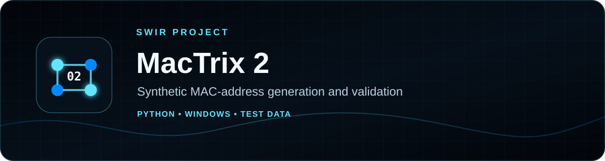

<!-- SWIR-README-STANDARD:v2 -->

<div align="center">



<br>


<br>

[](https://github.com/Swir/MacTrix/actions/workflows/ci.yml)


[](https://github.com/Swir/MacTrix/releases/tag/v2.1.0)

[](https://github.com/Swir)
[](https://github.com/Swir/MacTrix/stargazers)

<br>

[**Highlights**](#-highlights) · [**Quick Start**](#-quick-start) · [**Status**](STATUS.md) · [**Releases**](#-releases)

</div>

MacTrix 2 is a local desktop utility for generating, validating, importing and exporting **synthetic locally administered MAC addresses** for development, QA, documentation and authorized lab work. It does **not** change a network adapter's MAC address.


## 📍 Project Status


Product progress: **N/A** — this repository has no authoritative measurable product roadmap, so release versions, commits and test counts are not converted into a completion percentage.

| Item | Status |
|---|---|
| Current release | **v2.1.0** |
| Runtime | Python **3.10+** |
| Platform | Windows desktop project |
| Release artifacts | EXE, portable ZIP and SHA-256 files |
| Product progress source | [STATUS.md](STATUS.md) |

## 🚀 Overview

MacTrix preserves the original single-file application's core workflow while using the safer package architecture introduced in v2: choose a synthetic device profile, choose a count, generate unique values, inspect determinate 0–100% generation progress, load lists, validate/normalize them, sort/deduplicate them and export the result.

The built-in profiles intentionally use **locally administered unicast** namespaces rather than pretending generated addresses belong to real hardware vendors.

## ✨ Highlights

| Feature | What it does |
|---|---|
| ⚡ Standards-safe generation | Produces locally administered, unicast MAC addresses |
| 📦 Batch generation | Generates 1 to 100,000 unique values per run |
| 📊 Determinate generation progress | Shows real 0–100% progress while generating values |
| 🧩 Synthetic profiles | Generic, Desktop, Mobile, Router and IoT namespaces |
| 🛠️ Custom prefix | Accepts an optional 3-byte prefix and normalizes local/unicast bits |
| 🔤 Formatting | Colon, dash or no separator; upper- or lower-case output |
| 📥 Import | TXT, CSV and JSON with validation/normalization |
| 📤 Export | TXT, CSV and structured JSON |
| 🧹 Data cleanup | Sorting and one-click duplicate removal for imported lists |
| 🌍 Languages | English, Polish and Norwegian with system-language detection |
| 🧠 Preferences | Remembers language, profile, formatting and count |
| 🪵 Diagnostics | Uses a rotating local application log |

### Classic-to-modern feature map

| Original MacTrix | MacTrix 2.1 |
|---|---|
| Number of MAC addresses | Preserved, expanded to 1–100,000 |
| Device type selector | Preserved as Generic/Desktop/Mobile/Router/IoT synthetic profiles |
| Generate button | Preserved |
| Generation progress | Preserved and restored as determinate 0–100% progress |
| Result list + scrollbar | Preserved with a responsive table and large-batch preview |
| Save to TXT/CSV | Preserved, plus JSON |
| Load TXT/CSV | Preserved, plus JSON and validation |
| Sort | Preserved |
| Duplicate warning | Improved: generated values are unique; imported lists support dedupe |
| Footer / author credit | Preserved as `by Swir` |

### Synthetic profile prefixes

```text
Generic  02:00:00
Desktop  02:10:00
Mobile   02:20:00
Router   02:30:00
IoT      02:40:00
```

These prefixes are synthetic test namespaces, **not an IEEE OUI/vendor database**.


## ⚙️ Quick Start

### Recommended — Windows release

Download the verified **v2.1.0** assets from [GitHub Releases](https://github.com/Swir/MacTrix/releases/tag/v2.1.0). The release contains `MacTrix.exe`, a portable Windows x64 ZIP and SHA-256 checksum files.

### From source

```bash
git clone https://github.com/Swir/MacTrix.git
cd MacTrix
python -m pip install -e ".[test]"
python run.py
```

Non-GUI self-test:

```bash
python -m mactrix --smoke-test
```

GUI startup smoke test:

```bash
python -m mactrix --smoke-gui
```

Tests:

```bash
pytest
```

Documentation progress check:

```bash
python tools/readme_progress.py --check
```

## 📋 Requirements / Compatibility

- Python **3.10 or newer** for source use.
- The project targets Windows desktop use and publishes Windows x64 release artifacts.
- Runtime dependencies are intentionally minimal; test/build extras are declared in `pyproject.toml`.
- CI covers Python 3.10–3.14 and includes a Windows GUI startup smoke test.

## 🎮 Usage / Workflow

1. Choose a synthetic profile or custom prefix.
2. Choose output count and formatting.
3. Generate the dataset and monitor determinate generation progress.
4. Optionally load TXT, CSV or JSON data for validation and normalization.
5. Sort or deduplicate imported data when needed.
6. Export the full dataset to TXT, CSV or JSON.

Large batches keep the complete data available for export while limiting the UI preview for responsiveness.

## 🧠 Technology / Architecture

| Layer | Technology / role |
|---|---|
| Core | Python package under `src/mactrix/` |
| UI | Tkinter desktop application |
| Packaging | PyInstaller build path with generated Windows ICO |
| Tests | pytest + compile checks + source/GUI smoke paths |
| Persistence | Per-user settings and rotating local logs |

MacTrix works locally. It does not require an online API, query vendor databases or transmit generated/imported address lists.

## 📦 Releases

Latest public release: **[MacTrix v2.1.0](https://github.com/Swir/MacTrix/releases/tag/v2.1.0)**.

The release workflow publishes:

```text
MacTrix.exe
MacTrix.exe.sha256
MacTrix-vX.Y.Z-Windows-x64.zip
MacTrix-vX.Y.Z-Windows-x64.zip.sha256
```

## ⚠️ Limitations / Responsible Use

- MacTrix generates and validates synthetic address data; it **does not spoof or reconfigure network adapters**.
- Use it for development, testing, documentation and systems you are authorized to work with.
- The repository currently has no authoritative measurable product roadmap, so product completion is intentionally reported as **N/A**.

## 🔎 Search Keywords

`synthetic MAC address generator` • `MAC address validator` • `locally administered MAC address` • `Python Windows GUI` • `Tkinter MAC tool` • `MAC test data generator` • `MAC address batch generator` • `TXT CSV JSON MAC export` • `MAC address normalization` • `Windows desktop utility` • `network QA test data` • `offline MAC address tool`


<div align="center">

### `GENERATE • VALIDATE • TEST • EXPORT`

⭐ **If MacTrix is useful, consider leaving a star.**

[**← SWIR profile**](https://github.com/Swir) · [**All projects →**](https://github.com/Swir?tab=repositories)

</div>
